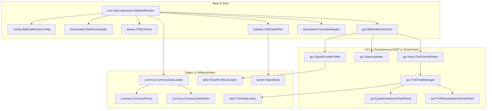

# MqlRealMonitor – System- und Architekturdokumentation

Dieses Dokument beschreibt die Architektur, die internen Abläufe, die Verzeichnisstrukturen und die Algorithmen der Java-Desktop-Anwendung **MqlRealMonitor**.

---

## 📊 1. Projektübersicht & Zweck

**MqlRealMonitor** ist eine hochperformante Java-Desktop-Anwendung zur automatischen und kontinuierlichen Überwachung von MQL5-Signalprovidern direkt von der MQL5-Community.

Das System lädt in konfigurierbaren Zeitintervallen die HTML-Seiten der gewünschten Signalprovider herunter, extrahiert wichtige finanzielle Parameter wie den Kontostand (Equity), den Floating Profit (schwebender Gewinn/Verlust) sowie den aktuellen Drawdown und stellt diese Daten in einer interaktiven GUI dar. Zudem speichert es diese Daten als historische Zeitreihen (Tick-Daten) in CSV-Dateien, um detaillierte Chart-Analysen zu ermöglichen.

### Kernfunktionen:
- 🌐 **Automatisierter Web-Download** von Signalprovider-Seiten mit intelligentem Fallback-Verhalten.
- 🔍 **Mehrstufiges Regex-HTML-Parsing** zur robusten Extraktion der Daten aus JavaScript-Arrays und HTML-Elementen.
- 💾 **Historische Datenpersistierung** im CSV-Format (Tick-Daten) für nachträgliche Auswertungen.
- 📊 **Dual-Chart-System** zur gleichzeitigen Anzeige der Equity-Drawdown-Entwicklung und der Profit-Entwicklung unter Verwendung von JFreeChart.
- 💱 **Automatisches Currency-Loading** von MQL5 zur Abfrage aktueller Währungskurse (z.B. XAUUSD, BTCUSD).
- 📈 **Perioden-Gewinn-Berechnung** zur automatisierten Kalkulation von Wochen- und Monatsgewinnen auf Basis der historischen Ticks.
- 📉 **Webbasierter Drawdown Analyzer** zur interaktiven, visuellen Auswertung aller historischen Drawdown-Phasen (Dauer, Tiefe, Erholungszeiträume).
- ⚡ **Asynchrone UI-Architektur**, die durch Background-Threads ein Blockieren des Haupt-GUI-Threads verhindert.

---

## 🏗️ 2. Architektur & Paket-Struktur

Die Anwendung folgt dem Prinzip einer modularen Schichtenarchitektur, bei der die Datenerfassung, das Parsing, die Persistenzschicht und die SWT-Benutzeroberfläche streng voneinander getrennt sind.

### Komponenten-Übersicht (Mermaid)



---

## 📁 3. Detaillierte Paket- und Klassenbeschreibung

### 3.1. Hauptpaket (`com.mql.realmonitor`)
- **[MqlRealMonitor.java](file:///d:/git/MQL/MqlRealmonitor/src/main/java/com/mql/realmonitor/MqlRealMonitor.java)**:
  Der zentrale Orchestrator. Initialisiert alle Subsysteme, verwaltet den wiederkehrenden Monitoring-Zyklus (`performMonitoringCycle`), empfängt Kommandozeilenparameter und startet das GUI.

### 3.2. Paket `config`
- **[MqlRealMonitorConfig.java](file:///d:/git/MQL/MqlRealmonitor/src/main/java/com/mql/realmonitor/config/MqlRealMonitorConfig.java)**:
  Verwaltet alle Pfade und anwendungsspezifischen Parameter. Liest und schreibt Konfigurationsdateien unter dem angegebenen `BASE_PATH` (Standard: `C:\Forex\MqlAnalyzer`).
- **[IdTranslationManager.java](file:///d:/git/MQL/MqlRealmonitor/src/main/java/com/mql/realmonitor/config/IdTranslationManager.java)**:
  Übersetzt die numerischen MQL5-Signal-IDs in lesbare Namen der Signalprovider für eine bessere GUI-Darstellung.

### 3.3. Paket `currency`
- **[CurrencyDataLoader.java](file:///d:/git/MQL/MqlRealmonitor/src/main/java/com/mql/realmonitor/currency/CurrencyDataLoader.java)**:
  Verantwortlich für das Laden von Währungskursen (z.B. Gold - XAUUSD oder Bitcoin - BTCUSD) von MQL5 im Hintergrund.
- **[CurrencyData.java](file:///d:/git/MQL/MqlRealmonitor/src/main/java/com/mql/realmonitor/currency/CurrencyData.java)**:
  Modellklasse zur Repräsentation eines Währungskurses zu einem bestimmten Zeitpunkt.
- **[CurrencyParser.java](file:///d:/git/MQL/MqlRealmonitor/src/main/java/com/mql/realmonitor/currency/CurrencyParser.java)**:
  Parst die Kursdaten aus den abgerufenen HTML-Inhalten.
- **[CurrencyDataWriter.java](file:///d:/git/MQL/MqlRealmonitor/src/main/java/com/mql/realmonitor/currency/CurrencyDataWriter.java)**:
  Schreibt die Kurshistorie in CSV-Dateien unter `Realtick\tick_kurse\`.

### 3.4. Paket `downloader`
- **[WebDownloader.java](file:///d:/git/MQL/MqlRealmonitor/src/main/java/com/mql/realmonitor/downloader/WebDownloader.java)**:
  Führt die HTTP-Downloads durch. Unterstützt Gzip-Kompression, Verbindungs-Timeouts und speichert die rohen HTML-Seiten im Download-Verzeichnis ab.
- **[FavoritesReader.java](file:///d:/git/MQL/MqlRealmonitor/src/main/java/com/mql/realmonitor/downloader/FavoritesReader.java)**:
  Liest die zu überwachenden MQL5-Signal-IDs aus der Konfigurationsdatei `favorites.txt`.
- **[DownloadResult.java](file:///d:/git/MQL/MqlRealmonitor/src/main/java/com/mql/realmonitor/downloader/DownloadResult.java)**:
  Strukturierte Transportklasse für das Download-Ergebnis. Enthält den HTML-Inhalt, den HTTP-Statuscode und detaillierte Fehlerbeschreibungen bei Verbindungsproblemen.

### 3.5. Paket `parser`
- **[HTMLParser.java](file:///d:/git/MQL/MqlRealmonitor/src/main/java/com/mql/realmonitor/parser/HTMLParser.java)**:
  Analysiert die HTML-Dateien der Signalprovider. Nutzt ein flexibles Regex-System zur Extraktion von Währungen, Kontostand, Floating Profit und Drawdowns. Unterstützt sowohl JavaScript-Daten-Arrays als auch reguläre HTML-Tags als Fallback.
- **[SignalData.java](file:///d:/git/MQL/MqlRealmonitor/src/main/java/com/mql/realmonitor/parser/SignalData.java)**:
  Datenmodell zur Speicherung der extrahierten Daten eines Signalproviders mit Validierungslogik.

### 3.6. Paket `data` & `tickdata`
- **[TickDataLoader.java](file:///d:/git/MQL/MqlRealmonitor/src/main/java/com/mql/realmonitor/data/TickDataLoader.java)**:
  Lädt und parst historische CSV-Tick-Dateien zur Bereitstellung der Datenreihen für die Diagramme.
- **[TickDataWriter.java](file:///d:/git/MQL/MqlRealmonitor/src/main/java/com/mql/realmonitor/tickdata/TickDataWriter.java)**:
  Erstellt und aktualisiert die CSV-Tick-Dateien der Signalprovider. Verhindert das Schreiben von Duplikaten durch Zeitstempel-Abgleich.

### 3.7. Paket `gui` (SWT-Oberfläche)
- **[MqlRealMonitorGUI.java](file:///d:/git/MQL/MqlRealmonitor/src/main/java/com/mql/realmonitor/gui/MqlRealMonitorGUI.java)**:
  Das Hauptfenster der SWT-Anwendung. Enthält die Tabelle der Signalprovider, Schaltflächen zum manuellen Aktualisieren und Laden von Kursen sowie die Menüleiste.
- **[SignalProviderTable.java](file:///d:/git/MQL/MqlRealmonitor/src/main/java/com/mql/realmonitor/gui/SignalProviderTable.java)**:
  Verwaltet die Tabelle mit den Signalprovidern. Sie bietet Sortierfunktionen, Farbkodierungen (z. B. Rot bei Verlusten, Grün bei Gewinnen) und zeigt berechnete Performance-Kennzahlen an.
- **[StatusUpdater.java](file:///d:/git/MQL/MqlRealmonitor/src/main/java/com/mql/realmonitor/gui/StatusUpdater.java)**:
  Aktualisiert periodisch die Statuszeile, überwacht den Speicherverbrauch der Java Virtual Machine (JVM) und zeigt die verbleibende Zeit bis zum nächsten Download an.
- **[AsyncTickChartWindow.java](file:///d:/git/MQL/MqlRealmonitor/src/main/java/com/mql/realmonitor/gui/AsyncTickChartWindow.java)**:
  Asynchrones Fenster zur Anzeige der Charts. Zeigt sofort eine Ladeanimation an und berechnet die Diagramme im Hintergrund, um ein Einfrieren der Benutzeroberfläche zu verhindern.
- **[TickChartManager.java](file:///d:/git/MQL/MqlRealmonitor/src/main/java/com/mql/realmonitor/gui/TickChartManager.java)**:
  Steuert die JFreeChart-Logik und koordiniert die Zeichnung des Drawdown- und Profit-Entwicklungsdiagramms.
- **[EquityDrawdownChartPanel.java](file:///d:/git/MQL/MqlRealmonitor/src/main/java/com/mql/realmonitor/gui/EquityDrawdownChartPanel.java)** & **[ProfitDevelopmentChartPanel.java](file:///d:/git/MQL/MqlRealmonitor/src/main/java/com/mql/realmonitor/gui/ProfitDevelopmentChartPanel.java)**:
  Wiederverwendbare GUI-Komponenten (Custom Controls) zur Darstellung der jeweiligen Diagramme.

---

## ⚡ 4. Kernmechanismen & Workflows

### 4.1. Der Monitoring-Zyklus

Der Überwachungszyklus läuft standardmäßig asynchron im Hintergrund:

1. **Favoriten laden**: Die Datei `favorites.txt` wird gelesen, um die zu überwachenden Signal-IDs zu bestimmen.
2. **Sequenzieller Download**:
   - Für jede ID wird die MQL5-Signal-Seite heruntergeladen.
   - Zwischen den Downloads wird eine zufällige Pause von 1 bis 3 Sekunden eingelegt, um eine Sperrung durch MQL5 (Rate Limiting) zu vermeiden.
3. **HTML-Parsing**: Die Daten (Kontostand, Floating Profit, Währung) werden extrahiert.
4. **Persistierung**: Falls neue Daten vorhanden sind (Prüfung auf geänderten Zeitstempel), werden diese an die CSV-Datei des Providers angehängt.
5. **UI-Update**: Die Daten werden thread-sicher via `Display.asyncExec` in die Tabelle eingepflegt.
6. **Währungskurse abrufen**: Nach Abschluss des Signal-Downloads werden automatisch die Währungskurse aktualisiert.
7. **Wartezeit**: Der Zyklus schläft für das konfigurierte Intervall (Standard: 60 Minuten).

### 4.2. Asynchrones Chart-Setup & UI-Responsiveness

Beim Öffnen historischer Charts von Signalprovidern mit sehr vielen Datenpunkten (teilweise zehntausende Zeilen in den CSV-Dateien) blockierte das Laden und Rendern in älteren Versionen das GUI für bis zu 60 Sekunden.

Zur Behebung wurde die **asynchrone Chart-Architektur** implementiert:
- Beim Doppelklick auf einen Provider öffnet sich sofort das `AsyncTickChartWindow`.
- Das Fenster zeigt eine animierte Lade-Anzeige ("Daten werden geladen...").
- Ein separater Hintergrund-Thread startet den `TickDataLoader` und berechnet das JFreeChart-Objekt.
- Nach erfolgreichem Laden werden die Diagramme an den SWT-UI-Thread übergeben und flackerfrei gerendert.

### 4.3. Währungskurs-Erfassung (Currency Loading)

Seit Version 1.2.1 verfügt das Programm über ein integriertes Modul zur Kurserfassung. Es ermöglicht das Abfragen und Speichern von aktuellen Währungskursen (z. B. XAUUSD und BTCUSD). Dies ist wichtig, da Signalprovider in unterschiedlichen Kontowährungen geführt werden und für eine korrekte Portfolio-Bewertung eine Umrechnung in die Basiswährung des Nutzers erfolgen muss.

### 4.4. Periodengewinn-Berechnung

Die Klasse `PeriodProfitCalculator` analysiert die historischen CSV-Daten eines Signalproviders, um den prozentualen und absoluten Gewinn für zwei Perioden zu ermitteln:
1. **Wochengewinn (Weekly Profit)**: Wertentwicklung seit dem letzten Montag 00:00 Uhr.
2. **Monatsgewinn (Monthly Profit)**: Wertentwicklung seit dem 1. Tag des aktuellen Monats 00:00 Uhr.

Die Werte werden in der Haupttabelle in separaten Spalten farblich markiert ausgegeben.

### 4.5. Webbasierter Drawdown Analyzer & Monatliche Performance

Der webbasierte **Drawdown Analyzer** (aufrufbar über die Haupt-Toolbar oder das Tabellen-Kontextmenü) ermöglicht eine vertiefte Analyse des Signal-Verlaufs:
- **Interaktiver Zeitraum-Filter (Zeitraum)**: Ermöglicht das schnelle Umschalten des Auswertungsfensters (Heute, 1 Woche, 1 Monat, Aktueller Monat, 6 Monate, Dieses Jahr, 1 Jahr, Alles). Die Berechnungen passen sich sofort dynamisch an.
- **Monatliche Performance**: Ein dual-achsiges Balken- und Liniendiagramm. Die Balken zeigen den monatlichen Gewinn/Verlust in Kontowährung (Grün für Gewinn, Rot für Verlust) auf der linken Y-Achse, während eine violette Trendlinie die prozentuale Entwicklung des Kontos auf der rechten Y-Achse darstellt. Beide Achsen sind perfekt symmetrisch ausgerichtet.
- **Interaktive Tooltips & Highlights**: Beim Bewegen der Maus über das Diagramm werden die betroffenen Balken und Datenpunkte visuell hervorgehoben und ein Tooltip mit den genauen Werten ($ und %) eingeblendet.

### 4.6. Top 10 MT4/MT5-Strategien Import

Über die Toolbar-Schaltfläche `"🏆 Top 10 MT4/MT5"` können die beliebtesten Strategien vollautomatisiert importiert werden:
- **Hintergrund-Download**: Die Anwendung lädt asynchron die MT4- und MT5-Signallisten (sortiert nach Abonnenten) herunter:
  - MT5: `https://www.mql5.com/de/signals/mt5/list?orderby=subscribers`
  - MT4: `https://www.mql5.com/de/signals/mt4/list?orderby=subscribers`
- **Regex-Parsing & HTML-Decoding**: Signal-IDs und Klarnamen werden über das Muster `data-id="(\d+)"\s+data-name="([^"]+)"` extrahiert. HTML-Entities werden im Namen automatisch dekodiert (z. B. `&amp;` -> `&`, `&#39;` -> `'`).
- **Vergleich & Favorisierung**: Der Importeur filtert bereits vorhandene Strategien heraus und fügt neue Signale der Favoritenklasse `"1"` hinzu. Der Name wird in `idtranslation.txt` registriert.
- **Tabelle aktualisieren**: Die Tabellenansicht lädt die Favoritenklassen und Namen in Echtzeit nach dem Import neu.

---

## 💾 5. Verzeichnisstrukturen & Datenfluss

Die Anwendung organisiert alle Daten unterhalb eines konfigurierbaren Basisverzeichnisses (`BASE_PATH`). Standardmäßig wird hierfür `C:\Forex\MqlAnalyzer` verwendet.

### 5.1. Struktur im Dateisystem

```
C:\Forex\MqlAnalyzer\ (oder benutzerdefinierter BASE_PATH)
├── config\
│   ├── favorites.txt                    # Liste der zu überwachenden Signal-IDs (eine ID pro Zeile)
│   └── idtranslation.txt                # Zuordnung von ID zu Name (Format: SignalID:Name)
├── logs\
│   └── MqlRealMonitor.log               # Anwendungs-Logfile
└── Realtick\
    ├── download\
    │   └── [Signal_ID].html             # Zuletzt heruntergeladene HTML-Rohseite des Providers
    ├── download_mql5\
    │   └── [Currency].html              # Heruntergeladene HTML-Seiten für Währungskurse
    ├── tick\
    │   └── [Signal_ID].txt              # CSV-Datei mit historischen Ticks des Providers
    └── tick_kurse\
        └── [Symbol].txt                 # CSV-Datei mit Währungskursverlauf (z.B. xauusd.txt)
```

### 5.2. CSV-Datenformate

#### Tick-Daten der Signalprovider (`Realtick\tick\[Signal_ID].txt`):
```csv
# Signal-ID: 4123456
# Created: 2026-05-23 20:00:00
# Format: Datum,Uhrzeit,Kontostand(Equity),FloatingProfit
23.05.2026,20:00:05,10450.25,120.50
23.05.2026,21:00:02,10480.10,-45.10
```

#### Währungskurse (`Realtick\tick_kurse\[Symbol].txt`):
```csv
# Symbol: XAUUSD
# Format: Datum,Uhrzeit,Kurs
23.05.2026,20:05:00,2420.75
23.05.2026,21:05:00,2418.90
```

---

## ⚡ 6. Start und Konfiguration

Die Anwendung kann flexibel konfiguriert und gestartet werden.

### 6.1. Start über `start.bat`
Das im Hauptverzeichnis liegende Startskript [start.bat](file:///d:/git/MQL/MqlRealmonitor/start.bat) übernimmt die komplette Umgebungskontrolle:
- Es prüft die Java-Version (mindestens Java 11 erforderlich).
- Falls die ausführbare Datei `target\mql-real-monitor.jar` nicht vorhanden ist, wird das Projekt automatisch kompiliert (`mvn clean package -DskipTests`).
- Das Skript leitet alle zusätzlichen Parameter transparent an die Java-Anwendung weiter.

#### Rebuild erzwingen:
Um eine Bereinigung und Neukompilierung des Projekts zu erzwingen, kann das Skript mit dem Parameter `-r` oder `--rebuild` gestartet werden:
```cmd
start.bat --rebuild
```

### 6.2. Kommandozeilenparameter
Beim Start können folgende Parameter übergeben werden:

| Parameter | Beschreibung | Beispiel |
|-----------|--------------|----------|
| `--base-path <pfad>` / `-b <pfad>` | Setzt den Basis-Pfad für Konfiguration, Downloads und Ticks. | `start.bat --base-path "D:\Trading\RealMonitor"` |
| `--help` / `-h` | Zeigt die Hilfe zu den Parametern an. | `start.bat --help` |

---

## 🛠️ 7. Systemanforderungen & Build

### Voraussetzungen:
- **Java SE Development Kit (JDK) 11** oder höher.
- **Maven 3.6** oder höher (nur zum Bauen/Kompilieren benötigt).

### Wichtige Maven-Abhängigkeiten (`pom.xml`):
- `org.eclipse.platform:org.eclipse.swt.win32.win32.x86_64` (Standard Widget Toolkit für Windows)
- `org.jfree:jfreechart` (Chart-Generierung)
- `org.seleniumhq.selenium:selenium-java` & `webdrivermanager` (Währungskurs-Scraping und Automatisierung)
- `ch.qos.logback:logback-classic` (Logging)
